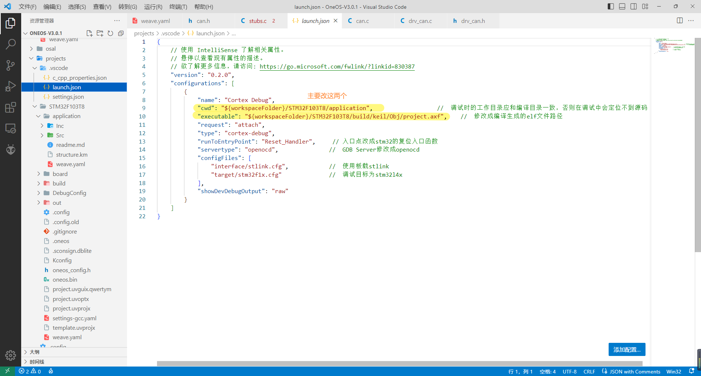

# 使用手册
在OneOS官网下V3.0.1的版本，解压后大概有2G，把里面的projects文件夹替换成这个就行。应该可以直接在keil中打开烧录运行。

引脚配置大概如下，其中usart2已经和esp32连好了，usart1从后面的洞里引出来了tx rx和地线。红色和黑色的线是tx和rx，而且恰好和usart2的相反，至于具体哪个是tx哪个是rx，1/2的概率试一下吧。

oneos cube中如果要启用其他功能的话，得试一下编译后有多大，而且还得大概预留2-3kb的空间，不然诸如malloc等语句会申请不到内存，这种原因产生的报错信息大致是sys_task非法访问或溢出。

在内核源码中对这部分进行了修改。起因是编译math.h中sqrt函数，或者任何c标准库中会产生报错、调用errno函数的地方编译都会报错"__aeabi_errno_addr重复定义"。咨询技术人员得到的解释是oneos与keil microlib的兼容性问题，目前兼容得还不是很好。他提出的解决办法是，要么keil里不勾选"use microlib"，要么把内核这部分注释掉。我选择了后者，不过我其实对注释掉这部分会产生什么坏影响还不清楚，虽然目前没发现有什么。

调试使用的是vscode的cortex debug插件，插件下载后需要手动在settings.json里配置工具链，只需要输入这三个的路径就行。

launch.json配置如下，黄色的部分可以根据自己文件夹的层次结构修改，或者直接用就行。

